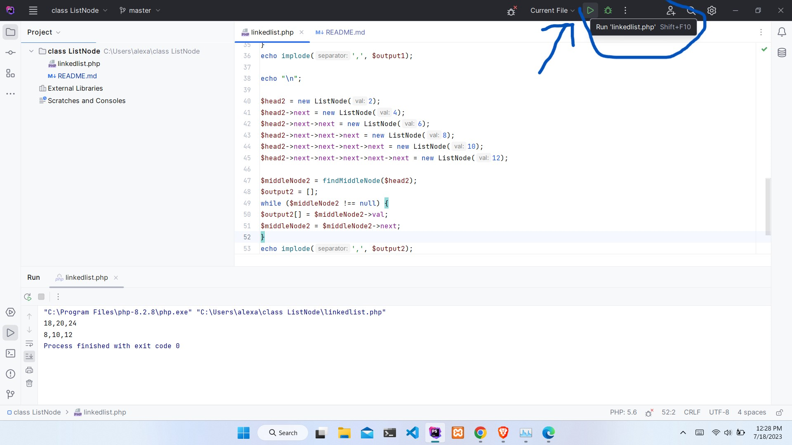

# Project requirements 
1 phpStorm 2023.1
2 php latest version installed on your machine.

# how to run the project 
1 clone the repository to your local machine and open the project folder with php storm.
 